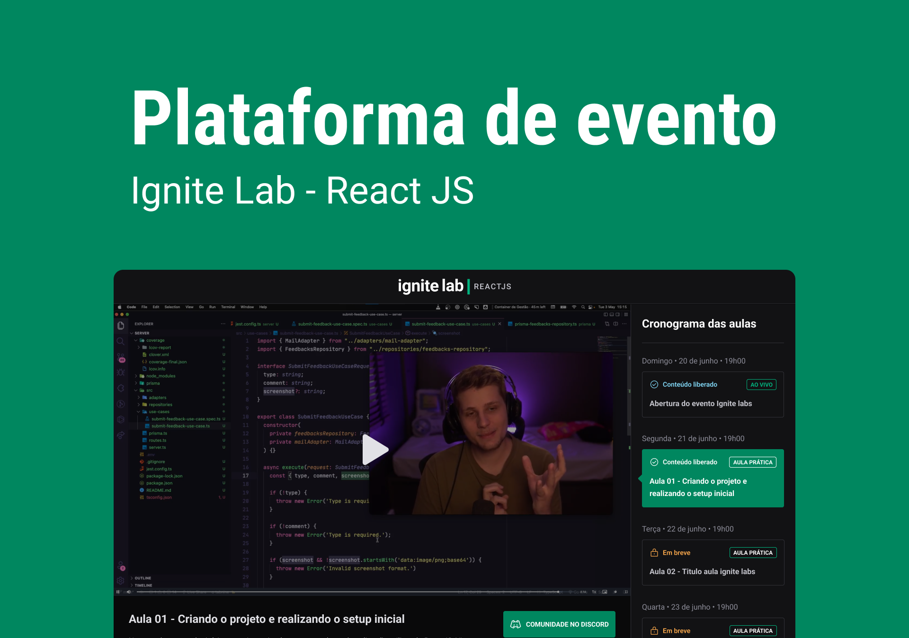

# Plataforma-de-Evento
Plataforma de eventos, é possível fazerv um cadastro e acessar as aulas do Ignite React JS, da Rocketseat.

## ✨ Tecnologias
React | GraphQL | GraphCMS | Apollo GraphQL | GraphQL Code Generator | Vite | Tailwind CSS | TypeScript



## 🔖 Layout
Você pode visualizar o layout do projeto através [desse link](https://www.figma.com/file/9EBWD92k1VQ7NLMlVJROYD/Plataforma-de-evento---Ignite-Lab-(Community)?node-id=24%3A904).

## 💻 Uso

```bash
# Clone o repositório
git clone https://github.com/mateusabelli/event-platform.git

# Acesse a pasta do projeto
cd event-platform

# Instale as dependências
npm install

#Adicione as variáveis de ambiente
Na pasta do projeto crie um arquivo chamado .env.local e adicione as seguintes informações

VITE_API_URL=ADICIONE AQUI O LINK DA API DO GRAPHCMS
VITE_API_ACCESS_TOKEN=ADICIONE AQUI O TOKEN DE ACESSO DA SUA API DO GRAPHCMS

# Execute a aplicação
npm run dev

Agora basta acessar a aplicação
```

<div align="center">
  <small>Desenvolvido por Vitório Gomes - Junho/2022</small>  
</div>
